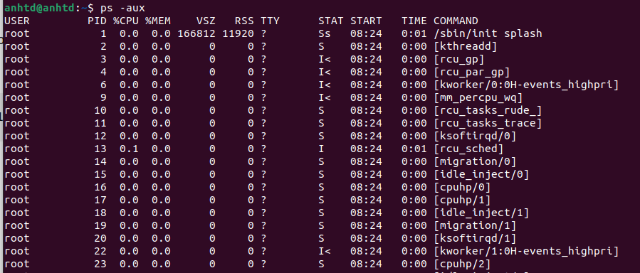
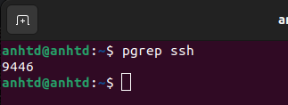
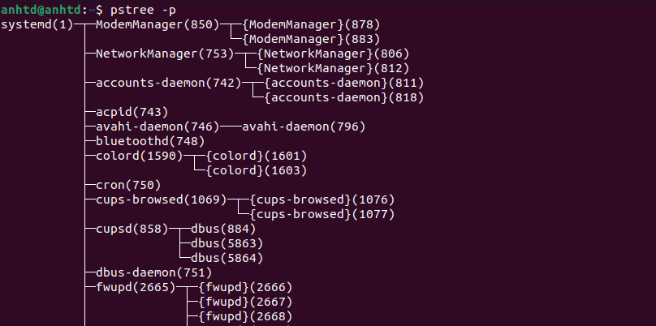
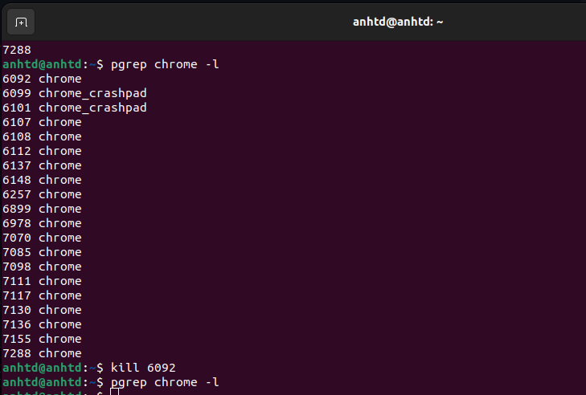

**#LINUX_TRAINING**


1. <a href='#1'> Check Diskspace
2. <a href='#2'> Check Partitions
3. <a href='#3'> Check CPU, RAM, network
4. <a href='#4'> Process Monitor
5. <a href='#5'> List Files and Directories
5. <a href='#6'> Actions with Files/Directories(move/copy,....)        
6. <a href='#7'> Basic and advanced decentralization
***
  
  
<div id='1'></div>
  
##  1. Check Diskspace
  
### - `df` command

The `df` command in Linux/Unix is used to display information related to file systems about total space and available space.
`df` is an abbreviation for "disk free".

### Syntax

```
df [OPTION]... [FILE]...
```

### Some option 
|**Short Flag**|**Long Flag**|**Description**|
|:--|:--|:--|
|`-a`|`--all`|Include pseudo, duplicate, inaccessible file systems.|
|`-h`|`--human-readable`|Print sizes in powers of 1024 (e.g., 1023M).|
|`-i`|`--inodes`|List inode information instead of block usage.|
|`-t`|`--type=TYPE`|Limit listing to file systems of type `TYPE`.|
|`-T`|`--print-type`|Print file system type.|
|<center>-</center>|`--help`|Display help message and exit.|
|<center>-</center>|`--version`|Output version information and exit.|

### Examples:
1. Show available disk space

**Action:**
--- Output the available disk space and where the directory is mounted

**Details:**
--- Outputted values are not human-readable (are in bytes)

**Command:**
```
df
```


2. Show available disk space in human-readable form

**Action:**
--- Output the available disk space and where the directory is mounted

**Details:**
--- Outputted values ARE human-readable (are in GBs/MBs)

**Command:**
```
df -h
```


3. Show available disk space for the specific file system

**Action:**
--- Output the available disk space and where the directory is mounted

**Details:**
--- Outputted values are only for the selected file system

**Command:**
```
df -hT file_system_name
```


## - `du` command
The `du` command, which is short for `disk usage` lets you retrieve information about disk space usage information in a specified directory. In order to customize the output according to the information you need, this command can be paired with the appropriate options or flags.

### Syntax:

```
du [OPTION]... [FILE]...
```

### Additional Flags and their Functionalities:

*Note: This does not include an exhaustive list of options.*

|**Short Flag**   |**Long Flag**   |**Description**   |
|:---|:---|:---|
|`-a`|`--all`|Includes information for both files and directories|
|`-c`|`--total`|Provides a grand total at the end of the list of files/directories|
|`-d`|`--max-depth=N`|Provides information up to `N` levels from the directory where the command was executed|
|`-h`|`--human-readable`|Displays file size in human-readable units, not in bytes|
|`-s`|`--summarize`|Display only the total filesize instead of a list of files/directories|


### Examples:

1. To show the estimated size of sub-directories in the a directory 

```
du -h 
```


2. To show the estimated size of sub-directories inside a specified directory:

```
du {PATH_TO_DIRECTORY}
```

  
  
<div id='2'></div>
  
### 2. Check Partitions

The `fdisk` command is used for controlling the disk partition table and making changes to it and this is a list of some of options provided by it : </b>
- Organize space for new drives.
- Modify old drives.
- Create space for new partitions.
- Move data to new partitions.

### Examples:

1. To view basic details about all available partitions on a particular disk:

```
fdisk -l particular_disk
```


2. To show the size of the partition /dev/sda

```
fdisk -s /dev/sda
```


  
  
 <div id='3'></div>

  ## Check CPU, RAM, network
  
  ## Check CPU with `lscpu` command
  
  `lscpu` in Linux/Unix is used to display CPU Architecture info. `lscpu` gathers CPU architecture information from `sysfs` and `/proc/cpuinfo` files.

### Options

`-a, --all`
    Include lines for online and offline CPUs in the output (default for -e). This option may only specified together with option -e or -p. 
    For example: `lsof -a`

`-b, --online`
    Limit the output to online CPUs (default for -p). This option may only be specified together with option -e or -p. 
    For example: `lscpu -b`

`-c, --offline`
    Limit the output to offline CPUs. This option may only be specified together with option -e or -p. 

`-e, --extended [=list]`
    Display the CPU information in human readable format.
    For example: `lsof -e`

### Example : 

  
  ## Check RAM - `free`/`vmstat` command
  
  
## - The `free` command

The `free` command in Linux/Unix is used to show memory (RAM/SWAP) information.

### Show memory usage

**Action:**
--- Output the memory usage - available and used, as well as swap

**Details:**
--- Outputted values are not human-readable (are in bytes)


### Examples:
1. Show memory usage in human-readable form
```
free -h 
```


2. Show memory usage in MB
```
free -m
```


## - `vmstat` command
The `vmstat` command lets you monitor the performance of your system. It shows you information about your memory, disk, processes,
CPU scheduling, paging, and block IO. This command is also referred to as **virtual memory statistic report**.

### Examples:

```
vmstat -a
```
If we run `vmstat -a`, it will show us the active and inactive memory of the system running.


```
vmstat
```


As you can see it is a pretty useful little command. The most important things that we see above are the `free`, which shows us the free space that is not being used, `si` shows us how much memory is swapped in every second in kB, and `so` shows how much memory is swapped out each second in kB as well.
  
  
## The `ping` command

The `ping` (Packet Internet Groper) command is used to check the network connectivity between host and server/host. This command takes as input the IP address or the URL and sends a data packet to the specified address with the message “PING” and get a response from the server/host this time is recorded which is called latency. Ping uses ICMP(Internet Control Message Protocol) to send an ICMP echo message to the specified host if that host is available then it sends ICMP reply message. Ping is generally measured in millisecond every modern operating system has this ping pre-installed.

The basic ping syntax includes ping followed by a hostname, a name of a website, or the exact IP address.

```
ping [option] [hostname] or [IP address]
```

### Examples:

1. To check whether a remote host is up, in this case, google.com, type in your terminal:

 ```
ping google.com
```

  
2. Controlling the number of pings: 
Earlier we did not define the number of packets to send to the server/host by using -c option we can do so. 

 ```
ping -c 5 google.com
```


3. Controlling the number of pings: 
Earlier a default sized packets were sent to a host but we can send light and heavy packet by using 
-s option. 

```
ping -s 30 -c 4 google.com
```
  


4. Changing the time interval: 
By default ping wait for 1 sec to send next packet we can change this time by using -i option.  

```
ping -i 3 -c 4 google.com
```


## `ifconfig` command
`ifconfig` is used to configure the kernel-resident network interfaces.  It is used at boot time to set up interfaces as necessary.  After that, it is usually only needed when debugging or when system tuning is needed.


If no arguments are given, `ifconfig` displays the status of the currently active interfaces.  If a single interface argument is given, it displays the  status  of the  given interface only; if a single -a argument is given, it displays the status of all interfaces, even those that are down.  Otherwise, it configures an interface.

  
# Examples:

1. To display the currently active interfaces:

```
ifconfig
```
  

2. To display details of the specific network interface (say `enp7s0`):
```
ifconfig enp7s0
```


3. To activate the driver for a interface (say `eth0`):
```
ifconfig eth0 up
```

  
<div id='4'><div>
  
 # Process Monitor
  
 ## `ps` command 
The `ps` command is a traditional Linux command to lists running processes. The following command shows all processes running on your Linux based server or system:
```
  ps -aux
```

 
The process ID (PID) is essential to kill or control process on Linux. 
  
  ## `pgrep` command
  `pgrep` is a command-line utility that allows you to find the process IDs of a running program based on given criteria. It can be a full or partial process name, a user running the process, or other attributes.
 
  ### Syntax 
  ```
  pgrep [OPTIONS] <PATTERN>
  ```
  
  ### Example
  When invoked without any option, `pgrep` displays the PIDs of all running programs that match with the given name. For example, to find the PID of the SSH server, you would run:



  The `-l` option tells `pgrep` to show the process name along with its ID:
  

  
 ### Another command to list process with an easy way for us to follow is `pstree` 
 To list process with PIDs you use
  ``` 
  pstree -p
  ```
  
 
  
 ## `kill` command
  `kill` command in Linux (located in /bin/kill), is a built-in command which is used to terminate processes manually. The `kill` command sends a signal to a process which terminates the process. If the user doesn’t specify any signal which is to be sent along with kill command then default _TERM_ signal is sent that terminates the process.
    
### Syntax

```
kill [OPTIONS] [PID]...
```
  
###  Examples:
1. To display all the available signals you can use below command option:

```
kill -l
```

2. To show how to use a _PID_ with the _kill_ command.

```
kill pid
```

  
